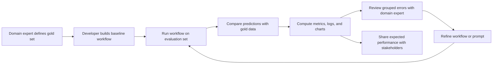

# Why This Library Exists

`extraction-testing` is designed to support evaluation-driven development (EDD) for extraction and classification workflows.

The short version is:

- building a first workflow is often feasible
- building a disciplined evaluation layer around it is the part teams often postpone
- postponing evaluation makes iteration less reliable and performance harder to explain
- this library exists to standardize that evaluation layer

## The practical problem

Suppose you want to extract contracts from a monthly report.

Implementing a first version of the workflow is usually straightforward enough:

- parse the report
- run the extraction logic
- return structured predictions

What slows teams down is the next step: turning that workflow into something they can improve systematically.

To do that well, the team needs to:

- compare predictions against a gold set
- compute useful metrics
- inspect mistakes in a structured way
- visualize and communicate overall performance

That work is important, but it is often rewritten from scratch for each project. As a result, teams either delay it or keep the evaluation layer too ad hoc to drive disciplined iteration.

## The EDD loop

The usual evaluation-driven loop looks like this:

This loop matters because it gives the team two different outputs:

- an iteration loop for improving the workflow
- a performance summary that can be shared with stakeholders

## Where domain experts fit

Many extraction problems are domain-heavy. A developer can usually build the software pipeline, but may not have enough domain knowledge to define intended behavior alone.

That is why the gold set is so important.

In practice, the domain expert often contributes in two places:

1. **Gold-set design**
   They help define representative examples, labels, extracted fields, and task boundaries.

2. **Error review**
   They explain what a mistake means in domain terms.

One useful review pattern is:

> If a junior analyst with no prior domain experience made this mistake, what would you say to explain what they misunderstood?

That kind of feedback is especially valuable in LLM workflows, where iteration often happens through prompt improvements, task definitions, extra instructions, or clearer field specifications.

## What this library replaces

This library is intended to standardize the repeated evaluation work in the middle of the loop.

It helps with:

- comparing predictions to gold data
- aligning rows or entities
- applying feature-specific equality rules
- calculating metrics
- writing logs
- generating basic visualizations

It is a way to outsource the repeated engineering work in the evaluation layer so that developers do not have to rebuild it for every new workflow.

## What this library does not replace

This library does not replace:

- domain expertise
- gold-set design
- workflow implementation
- error analysis and iteration decisions

The most important design work still lives in the evaluation set. That is where the task definition, intended behavior, and acceptable tradeoffs are encoded.

## Why this matters in production

In many production environments, there is a real tension between speed and quality:

- shipping fast favors minimal implementation effort
- shipping safely requires an evaluation loop with visible performance

The goal of this library is to lower that tradeoff. If the evaluation layer is cheap to set up, teams are more likely to keep the discipline of measuring and improving behavior instead of relying on informal spot checks.

## How the supported task types fit the motivation

The task types in this library match common evaluation shapes:

| Real task shape | Typical example | Library task type |
|---|---|---|
| One label per record | sentiment, routing label, final subfolder | `SINGLE_FEATURE` |
| One structured object per record | key fields from an article or form | `SINGLE_ENTITY` |
| Multiple entities per source | contracts, people, products, events in a report | `MULTI_ENTITY` |

Examples:

- classifying a text into one final category is usually `SINGLE_FEATURE`
- extracting several key fields from one article is usually `SINGLE_ENTITY`
- extracting multiple contracts from a report is usually `MULTI_ENTITY`
- routing a document into a folder hierarchy can be `SINGLE_FEATURE` or `SINGLE_ENTITY`, depending on whether you score only the final label or the full path

## A useful mental model

Think of the library as the reusable evaluation layer around an extraction workflow.

You still need to:

- define the gold set
- build the workflow
- improve it over time

But you do not need to write the comparison, metric, logging, and visualization code from scratch each time.

## Related pages

- [Choosing a Task Type](../getting-started/task-selection.md)
- [Task Types](task-types.md)
- [Metrics](metrics.md)
